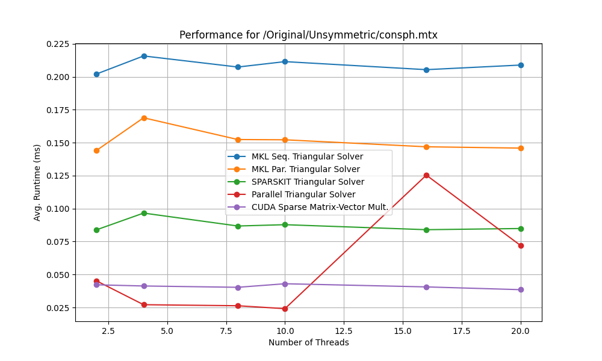

# Implementación de un Algoritmo para Resolver Sistemas Triangulares Dispersos con CUDA

## Link
[Paper][https://drive.google.com/file/d/1MjgdJh1UqvGKaeE8PXLsGYKZRiIzYvFb/view?usp=sharing]
[Slides][https://drive.google.com/file/d/19ZaKua0VPt9jdBqbVeGOd_k1lBvi20GQ/view?usp=sharing]

## Introducción

La resolución de sistemas lineales triangulares dispersos es esencial en aplicaciones como la simulación numérica y análisis estructural. Este proyecto implementa un **solucionador paralelo en GPU** utilizando **CUDA** para optimizar el rendimiento y mejorar la escalabilidad en la resolución de matrices triangulares dispersas.

El trabajo se compara con bibliotecas de CPU como:
- **MKL (Math Kernel Library)** en modo secuencial y paralelo.
- **SPARSKIT** para matrices dispersas.

El objetivo principal es demostrar las ventajas del uso de GPUs sobre las CPUs, especialmente en sistemas de gran escala.

---

## Propuesta

El solucionador propuesto resuelve sistemas de la forma:

\[
Ux = b,
\]

donde \( U \) es una matriz triangular superior dispersa, \( b \) es el vector del lado derecho y \( x \) es el vector solución.

### Metodología:

1. **Paralelización en CUDA**:  
   El algoritmo descompone la matriz \( U \) en bloques independientes y asigna cada fila de la matriz a un hilo en la GPU.  
2. **Optimización de memoria**:  
   Se minimiza el acceso irregular a memoria mediante la representación dispersa de matrices.  
3. **Comparación de rendimiento**:  
   Se realiza una comparación con solucionadores basados en CPU utilizando las siguientes matrices:
   - `bmwcra_1`
   - `boneS01`
   - `consph`
   - `torso3`
   - `ct20stif`
---

### Código

```cpp
__global__ void triangularMatrixVectorMultKernel(int m, double *a, int *ia, int *ja, double *x, double *b) {
    int row = blockIdx.x * blockDim.x + threadIdx.x;

    if (row < m) {
        double sum = 0.0;
        // Iterar sobre los elementos no nulos de la fila 'row'
        for (int idx = ia[row]; idx < ia[row + 1]; ++idx) {
            int col = ja[idx];  // Índice de la columna
            sum += a[idx] * x[col];  // Realizamos la multiplicación
        }
        b[row] = sum;  // Almacenamos el resultado en 'b'
    }
}

extern "C" void triangularMatrixVectorMultCUDA(int m, double *a, int *ia, int *ja, double *x, double *b) {
    double *d_a, *d_x, *d_b;
    int *d_ia, *d_ja;

    // Tamaño de la memoria a reservar para los arreglos en la GPU
    size_t size_a = sizeof(double) * (ia[m] - ia[0]);  // Solo la cantidad de elementos no nulos
    size_t size_x = m * sizeof(double);
    size_t size_b = m * sizeof(double);
    size_t size_ia = (m + 1) * sizeof(int);  // Tamaño del índice IA
    size_t size_ja = (ia[m] - ia[0]) * sizeof(int);  // Número de valores no nulos

    // Asignar memoria en el dispositivo para los valores de la matriz, vectores y arreglos de índices
    cudaMalloc(&d_a, size_a);
    cudaMalloc(&d_x, size_x);
    cudaMalloc(&d_b, size_b);
    cudaMalloc(&d_ia, size_ia);
    cudaMalloc(&d_ja, size_ja);

    // Copiar datos desde el host hacia el dispositivo
    cudaMemcpy(d_a, a, size_a, cudaMemcpyHostToDevice);
    cudaMemcpy(d_x, x, size_x, cudaMemcpyHostToDevice);
    cudaMemcpy(d_ia, ia, size_ia, cudaMemcpyHostToDevice);
    cudaMemcpy(d_ja, ja, size_ja, cudaMemcpyHostToDevice);

    // Obtener propiedades de la GPU
    int deviceId;
    cudaGetDevice(&deviceId);

    cudaDeviceProp deviceProp;
    cudaGetDeviceProperties(&deviceProp, deviceId);

    // Información relevante de la GPU
    int maxThreadsPerBlock = deviceProp.maxThreadsPerBlock;  // Número máximo de hilos por bloque
    int warpSize = deviceProp.warpSize;  // Tamaño del warp (32 hilos)
    int numSM = deviceProp.multiProcessorCount;  // Número de multiprocesadores

    // Establecer un tamaño de bloque óptimo
    int blockSize = maxThreadsPerBlock;  // Usamos el máximo permitido por la GPU
    int numBlocks = (m + blockSize - 1) / blockSize;  // Número de bloques necesarios

    // Lanzar el kernel
    triangularMatrixVectorMultKernel<<<numBlocks, blockSize>>>(m, d_a, d_ia, d_ja, d_x, d_b);

    // Esperar a que el kernel termine de ejecutarse
    cudaDeviceSynchronize();

    // Copiar los resultados de vuelta al host
    cudaMemcpy(b, d_b, size_b, cudaMemcpyDeviceToHost);

    // Liberar la memoria del dispositivo
    cudaFree(d_a);
    cudaFree(d_x);
    cudaFree(d_b);
    cudaFree(d_ia);
    cudaFree(d_ja);
}
```

## Resultados

Los resultados comparan el rendimiento entre GPU y CPU para diferentes matrices triangulares dispersas.

### 1. Matriz `bmwcra_1`


- **CUDA** logra tiempos mínimos (~0.05 ms).
- **MKL secuencial** se mantiene estable (~0.35 ms).
- El solucionador paralelo presenta ineficiencias con el aumento de hilos.

---

### 2. Matriz `boneS01`


- **CUDA** mantiene tiempos constantes (~0.5 ms).
- **MKL y SPARSKIT** muestran tiempos más altos (~1.2 - 1.4 ms).
- El solucionador paralelo incrementa su tiempo con más hilos.

---

### 3. Matriz `consph`


- **CUDA** presenta el mejor rendimiento (~0.04 ms).
- El solucionador paralelo alcanza un pico notable a 15 hilos (~0.125 ms).
- **MKL y SPARSKIT** son estables (~0.1 ms).

---

### 4. Matriz `torso3`


- **CUDA** mantiene el menor tiempo (< 0.5 ms).
- El solucionador paralelo aumenta exponencialmente a 20 hilos (~14.5 ms).
- **MKL y SPARSKIT** permanecen estables (~3-4 ms).

---

### 5. Matriz `ct20stif`


- **CUDA** logra tiempos mínimos (~0.5 ms).
- El solucionador paralelo incrementa linealmente (~3.2 ms a 20 hilos).
- **MKL y SPARSKIT** son estables (~1.2 - 1.4 ms).

---

## Conclusiones

- **CUDA** ofrece el mejor rendimiento con tiempos mínimos constantes, hasta 7 veces más rápido que los solucionadores de CPU.
- Los solucionadores **MKL** y **SPARSKIT** muestran estabilidad, pero tiempos más altos.
- El **solucionador paralelo en CPU** es ineficiente con un alto número de hilos, especialmente en matrices grandes.
- En matrices pequeñas, **CUDA** mantiene su ventaja con tiempos inferiores a 0.05 ms.

